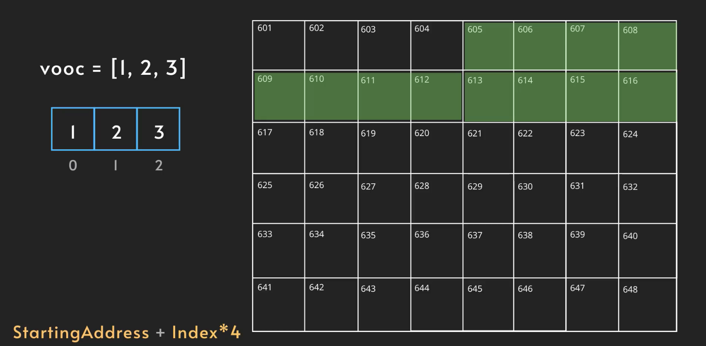

title:: Data Structure/Array
alias:: 数据结构/数组

- Type
	- Static:
	  Fixed number of memory slots
	- Dynamic:
	  Flexible number of memory slots
- Operations
	- Access
	  
	  因为 Array 是连续存储所以可以通过计算公式得出每一个 item 对应的开始地址（常数4即32位cpu寄存器的位宽32bit(4byte)，如果是64位cpu寄存器的位宽为64bit(8byte)即8）
	  综上在 Array 中访问任意 item 复杂度：**O(1)**
		- Update
		  更新操作复杂度一样为O(1)
		- Traversal
		  遍历所有 item 则复杂度为 O(n)
	- Search
	  搜索需要遍历所有 item 并比对相应的值所以复杂度为 **O(n)**
		- Copy
		  复制操作不仅需要遍历访问 Array 的所有值，而且还花费原Array所付出的创建时间和空间，复杂度为O(n)
	- Insert
	  插入操作分为在不同位置：Beginning、End、Middle
	  当要插入一个值时，操作系统需要复制之前的所有 item，然后寻找可以容纳插入后长度的新内存块写入，最后删除之前占用的内存块
	  复杂度为 **O(n)**，在这里我们讨论的是 Static Array。
	  
	  对于 Dynamic Array，始终会以2的n次幂进行容量的初始化，当插入的 item 达到容量，则会执行和 Static Array 一样的复制操作进行扩容，而扩容的容量大小则为2的n+1次幂。复杂度在未达到容量上限并且在尾部插入为O(1)，当达到容量上限执行复制操作以及从头部或者中间插入时为O(n)。
	- Delete
	  根据位置不同复杂度也不同
		- Beginning
		  复杂度为**O(n)**
		- End
		  复杂度为O(1)
		- Middle
		  复杂度为O(n)