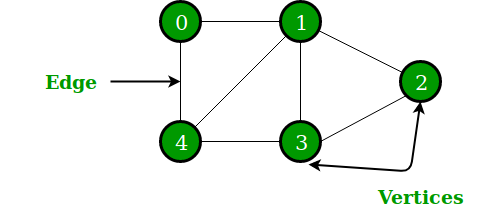
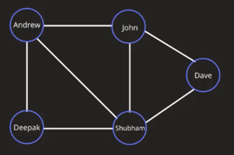
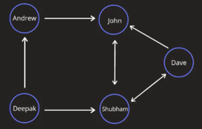
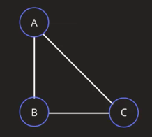
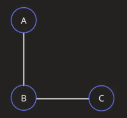
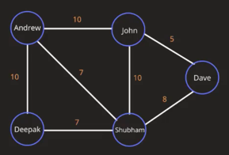

title:: Data Structure/Graphs
alias:: 数据结构/图

- 
- 类型
	- 无向图
	  
	- 有向图
	  
	- 循环图
	  
	- 无环图
	  
	- 无权重图
	  
	- 权重图
	  
- # 参考
- 1. https://www.geeksforgeeks.org/graph-data-structure-and-algorithms/
-