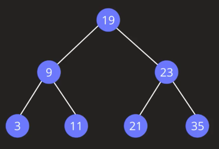
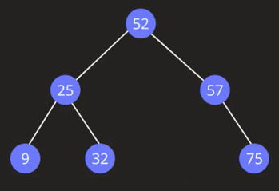
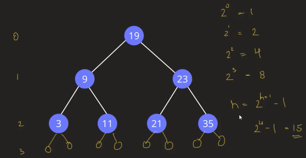
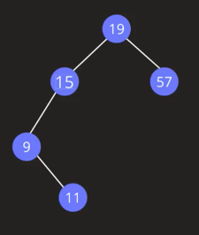

title:: Data Structure/Trees/Binary Search Tree
alias:: 数据结构/树/二叉搜索树

- 
- 左边子节点比父节点小，右边子节点比父节点大
- **类型**
	- Balanced BST（平衡二叉搜索树）
	  
		- 左子树和右子树的高度差都不大于1
		- 高度近似log(n)
		  
		- 动作
			- Search 复杂度 O(logn)
			- Insert  复杂度  O(logn)
			- Delete 复杂度
				- 0 个子节点 O(logn)
				- 1个子节点  O(logn)
				- 2个子节点 O(logn)
	- Unbalanced BST（非平衡二叉搜索树）
	  
		- 左子树和右子树的高度差大于1
		- 高度近似n
		- 所有动作的复杂度为O(n)