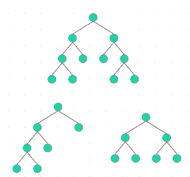
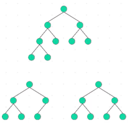
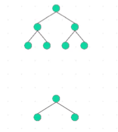
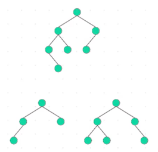
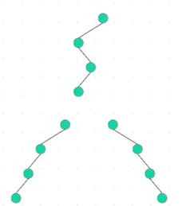

title:: Data Structure/Trees/Binary Tree
alias:: 数据结构/树/二叉树

- **基本知识**
	- 每个节点最多可以有两个子节点
- **分类**
	- Full Binary Tree (满二叉树)
	  **每个节点只允许有0个或2个子节点**
	  
	- Complete Binary Tree (完全二叉树)
	  **除了最后一级，其余的层级都应该被填满，最后一级可以有空节点但所有节点应该左对齐**
	- Perfect Binary Tree (完美二叉树)
	  **所有内部节点都有两个子节点，叶子节点处于相同深度或相同层级**
	  
	- Balanced Binary Tree (平衡二叉树)
	  **任一节点对应的两棵子树的最大高度差为1**
	  
	- Degenerate Binary Tree (退化二叉树)
	  **所有父节点都只有一个子节点**
	  
-