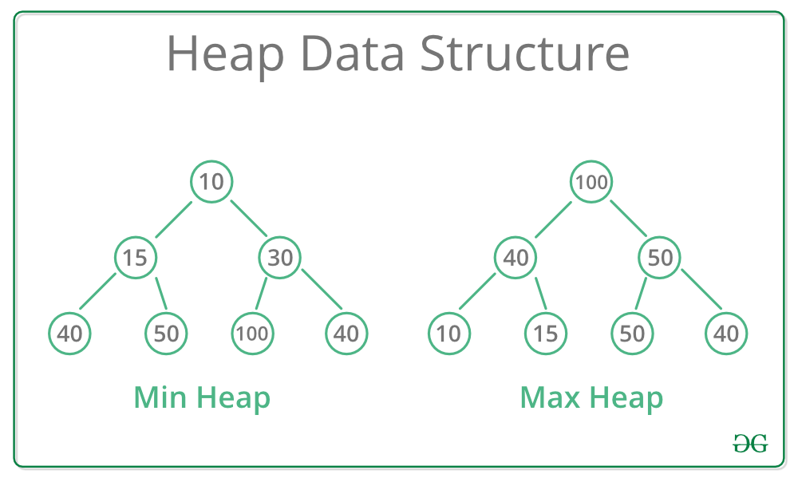

title:: Data Structure/Trees/Heaps
alias:: 数据结构/树/堆

- **类型**
  
	- Max-Heap 根节点必须比所有子节点大，所有子树同理
	- Min-Heap 根节点必须比所有子节点小，所有子树同理
	- **动作**
		- Search O(n)
		- Insert O(logn)
		- Delete O(nlogn)
	- 优先队列
	-