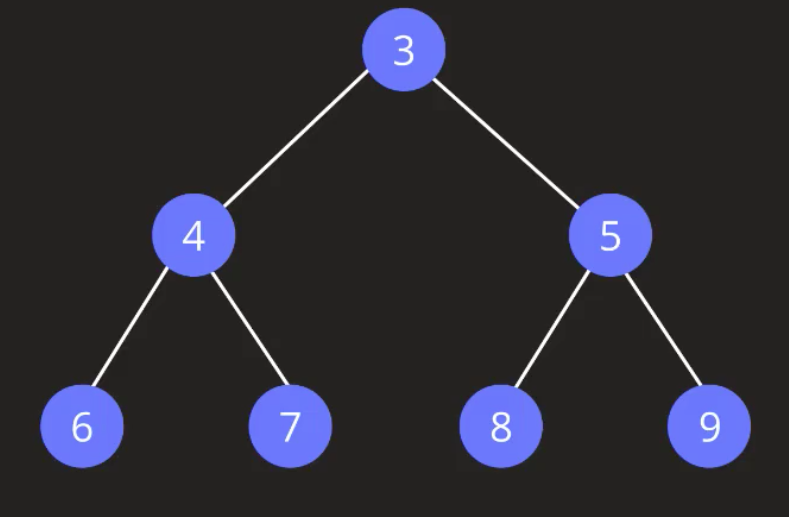
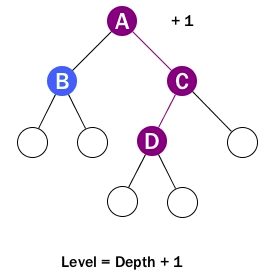
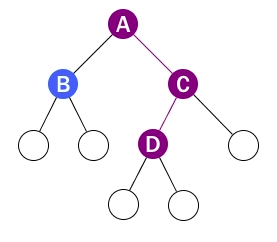
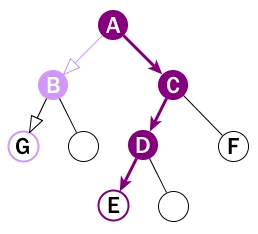

title:: Data Structure/Trees
alias:: 数据结构/树

- 
- **基本属性**
	- Node
	  构成树的基本单位
	- Root
	  在上图中 3即根节点
	- Parent
	  3、4、5 为父节点
	- Child
	  4、5、6、7、8、9为子节点
	- Leaf Node
	  6、7、8、9为叶子节点
	- Sibling
	  4和5，6和7，8和9互为兄弟节点，拥有共同父节点的子节点才互为兄弟节点
	- Edge
	  连接所有节点的线即为边
	  number = node number - 1
	- Path
	  3-4-6，3-4-7，3-5-8，3-5-9
	- SubTree
	- (4,6,7)，(5,8,9)
	- Levels
	  层级为深度加1。**它从1开始，所以根的 Level 为 1**
	  
	- Depth
	  节点的深度是从节点到根节点的边数。**根的深度为0**
	  
	- height
	  节点高度是指该节点和叶子节点之间最长路径的边数
	  
	  上图中是 A-E 路径的边数，即高度为3
- **树的类型**
	- [[Data Structure/Trees/Binary Tree]]
	- [[Data Structure/Trees/Binary Search Tree]]
	- [[Data Structure/Trees/Heaps]]
	- [[Data Structure/Trees/Trie]]
-
-
-
- # 参考
- 1. http://typeocaml.com/2014/11/26/height-depth-and-level-of-a-tree/
  2. https://visualgo.net/zh (可视化数据结构与算法)
  3. https://www.cs.usfca.edu/~galles/visualization/RedBlack.html （可视化红黑树）
-