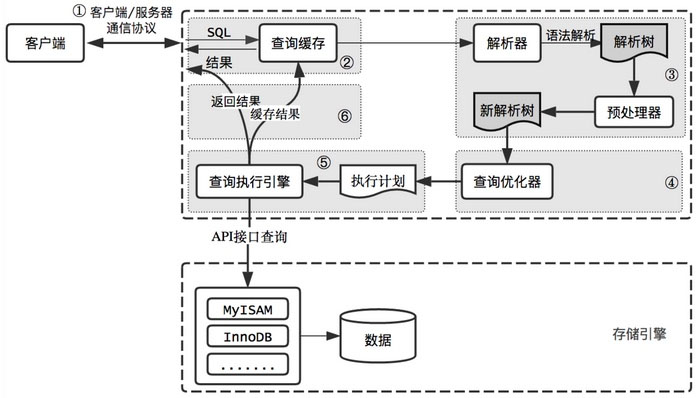

- 
- 1. 客户端/服务器通信协议
	- 通信协议是 [[半双工]]的，要不是服务器向客户端发送数据，要不是客户端向服务器发送数据。所以无法将消息进行切分发送
	- 无法进行流量控制，一端开始发送消息，另一端要接收完整个消息才能响应
	- 前面说的客户端只能接收完整的数据结果，所以在必要的时候一定要在查询中加上LIMIT
- 2. 查询缓存
	- 如果缓存打开的情况下，会优先检查这个查询是否命中查询缓存中的数据
	- 查询缓存可以在不同客户端之间共享
	- 检查时通过一个对大小写敏感的哈希查找实现
	- 不会匹配缓存结果
		- 查询即使只有一个字节（例如，空格、注释、大小写）不同也无法匹配
		- 两次调用会产生不一样结果的函数例如Now
		- 用户自定义变量和函数、系统表例如mysql、infomation_schema、performance_schema数据库中的表
	- 缓存失效
		- 缓存系统监控涉及的每张表，只要该表结构或者数据修改则与该表相关的所有查询都会失效
			- INSERT、UPDATE、DELETE、TRUNCATE TABLE、ALTER TABLE、DROP TABLE或DROP DATABASE
	- 查询命中查询缓存，返回结果前会检查用户权限
	- #+BEGIN_IMPORTANT
	  从 MySQL 5.7.20 开始，不推荐使用查询缓存，在 MySQL 8.0 中将删除
	  #+END_IMPORTANT
- 3.语法解析
	- MySQL 通过关键字将SQL语句进行分析并生成一棵对应的“解析树”
	- MySQL 解析器将使用 MySQL 语法规则验证和解析查询
	- 预处理器根据MySQL 规则进一步检查解析树是否合法，例如检查数据表和数据列是否存在，还会解析名字和别名，是否有歧义
	- 预处理器会验证相应权限
- 4. 查询优化器
	- 查询优化器时一个非常复杂的部件，它使用了很多优化策略来生成有一个最优的执行计划
	- 优化策略可以简单地分为两种，一种是静态优化，一种是动态优化
		- 静态优化可以直接对解析树进行分析， 并完成优化。例如，优化器可以通过一些简单的代数变换将WHERE 条件 转换成另一种等价形式。静态优化不依赖于特别的数值，如WHERE 条件 中带入的一些常数等。静态优化在第一次完成后就一直有效，即使使用 不同的参数重复执行查询也不会发生变化。可以认为这是一种“编译时 优化”
		- 动态优化则和查询的上下文有关，也可能和很多其他因素有 关，例如WHERE 条件中的取值、索引中条目对应的数据行数等。这需要 在每次查询的时候都重新评估，可以认为这是“运行时优化”
	- MySQL能够处理的优化类型
		- 重新定义关联表的顺序
		- 将外连接转化成内连接
		- 将外连接转化成内连接
		- 优化COUNT()、MIN()和MAX()
		- 预估并转化为常数表达式
		- 覆盖索引扫描
		- 子查询优化
		- 提前终止查询
		- 等值传播
		- 列表IN()的比较
	- 优化器有时候无法给出最有的结果，所以还需要人为干预使应用逻辑使其与某些条件成立
- 5. 查询执行引擎
	- 简单根据执行计划给出的指令逐步执行
	- 根据执行计划逐步执行的过程中，有大量的操作需要通过调用存储引擎实现的接口来完成，这些 接口也就是我们称为“handler API ”的接口
	- #+BEGIN_WARNING
	  并不是所有的操作都由handler完成。例如，当MySQL需要进行表锁的时候。handler可能会实现自己的级别的、更细粒度的锁，如InnoDB就实现了自己的行基本锁，但这并不能代替服务器层的表锁。如果是所有存储引擎共有的特性则由服务器层实现，比如时间和日期函数、视图、触发器等。
	  #+END_WARNING
	- 为了执行查询，MySQL只需要重复执行计划中的各个操作，直到 完成所有的数据查询
- 6. 返回结果给客户端
	- 即使查询不需要 返回结果集给客户端，MySQL仍然会返回这个查询的一些信息，如该 查询影响到的行数
	- 如果查询可以被缓存，那么MySQL在这个阶段也会将结果存放到 查询缓存中
	- MySQL将结果集返回客户端是一个增量、逐步返回的过程。例 如，我们回头看看前面的关联操作，一旦服务器处理完最后一个关联表，开始生成第一条结果时，MySQL就可以开始向客户端逐步返回结 果集了
	- 结果集中的每一行都会以一个满足MySQL客户端/服务器通信协议的封包发送，再通过TCP协议进行传输，在TCP传输的过程中，可能对 MySQL的封包进行缓存然后批量传输