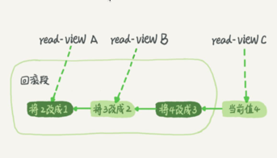

- # 隔离性与隔离界别
	- ACID（Atomicity、Consistency、Isolation、Durability，即原子性、一致性、隔离性、持久性）
	- SQL 标准的事务隔离级别：
	  collapsed:: true
		- 读未提交（read uncommitted）：事务还没提交时，它做的变更就能被别的事务看到。
		- 读提交（read committed）：事务提交后，它做的变更才会被其他事务看到。
		- 可重复读（repeatable read）：事务执行过程中看到的数据，总是跟这个事务在启动时看到的数据时一致的。在可重复读隔离级别下，未提交变更对其他事务也是不可见的。
		- 串行化（serializable）：对于同一行记录，“写”会加“写锁”，“读”会加“读锁”。当出现读写锁冲突时，后访问的事务必须等钱一个事务执行完成，才会继续执行。
	- 事例：
	  collapsed:: true
		- | 事务A      | 事务B   |
		  | :---        |    :----:   |
		  | 启动事务 查询得到值1   |  启动事务   |
		  | | 查询得到值1| 
		  |  | 将1改成2|
		  | 查询得到值V1| | 
		  | | 提交事务B| 
		  | 查询得到值V2| | 
		  | 提交事务A| |
		  | 查询得到值V3| |
		- 读未提交：V1值为2。这个时候事务B虽然还没有提交，但是结果已经被A看到了。因此，V2、V3也都是2。
		- 读提交：V1是1，V2的值是2。事务B的更新在提交后才能被A看到。所以，V3的值也是2。
		- 可重复读：V1、V2是1，V3是2。遵循事务在执行期间看到的数据前后必须一致。
		- 串行化：当事务B执行“将1改成2”的时候，会被锁住。直到事务A提交后，事务B才可以继续执行。所以从A的角度看，V1、V2的值是1，V3的值是2。
	- 在实现上，数据库里面会创建一个视图，访问的时候以视图的逻辑结果为准。在“可重复读”隔离级别下，这个视图是在事务启动时创建的，整个事务存在期间都用这个视图。在“读提交”隔离级别下，这个视图是在每个 SQL 语句开始执行的时候创建的。这里需要注意的是，“读未提交”隔离级别下直接返回记录上的最新值，没有视图概念；而“串行化”隔离级别下直接用加锁的方式来避免并行访问。
- # 事务隔离的实现
	- 在 MySQL 中，实际上每条记录在更新的时候都会同时记录一条回滚操作。记录上的最新值，通过回滚操作，都可以得到前一个状态的值。
	- 假设一个值从 1 被按顺序改成了 2、3、4，在回滚日志里面就会有类似下面的记录。
	- 
	- 当前值是 4，但是在查询这条记录的时候，不同时刻启动的事务会有不同的 read-view。如图中看到的，在视图 A、B、C 里面，这一个记录的值分别是 1、2、4，同一条记录在系统中可以存在多个版本，就是数据库的多版本并发控制（MVCC）。对于 read-view A，要得到 1，就必须将当前值依次执行图中所有的回滚操作得到。
	- 即使现在有另外一个事务正在将 4 改成 5，这个事务跟 read-view A、B、C 对应的事务是不会冲突的。
	- 当系统里没有比这个回滚日志更早的 read-view 的时候，回滚日志将会被删除。
	- 长事务意味着系统里面会存在很老的事务视图。由于这些事务随时可能访问数据库里面的任何数据，所以这个事务提交之前，数据库里面它可能用到的回滚记录都必须保留，这就会导致大量占用存储空间。
- # 事务的启动方式
	- 1.显式启动事务语句， begin 或 start transaction。配套的提交语句是 commit，回滚语句是 rollback。
	  2.set autocommit=0，这个命令会将这个线程的自动提交关闭。意味着如果只执行一个select语句，这个事务就启动了，而且并不会自动提交。这个事务持续存在直到你主动执行 commit 或 rollback语句，或者断开连接。