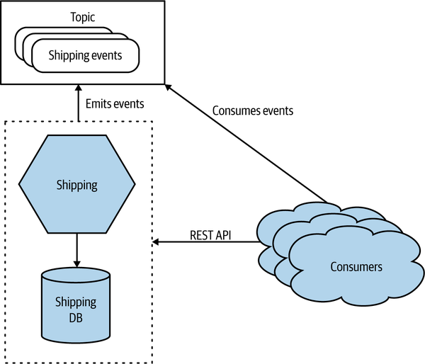
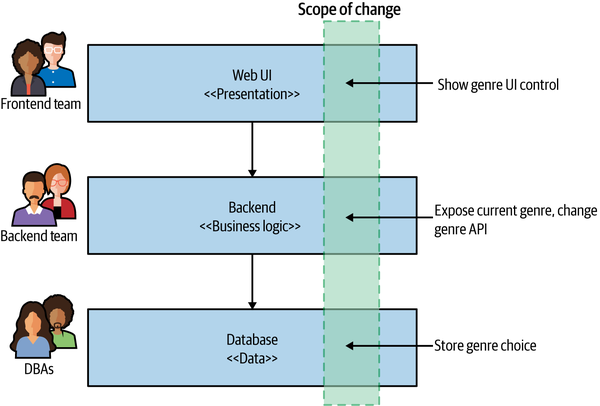
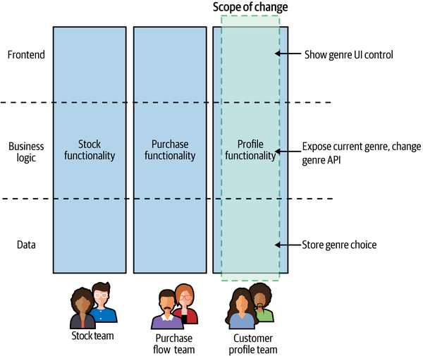
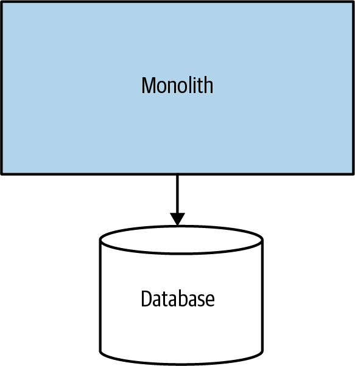
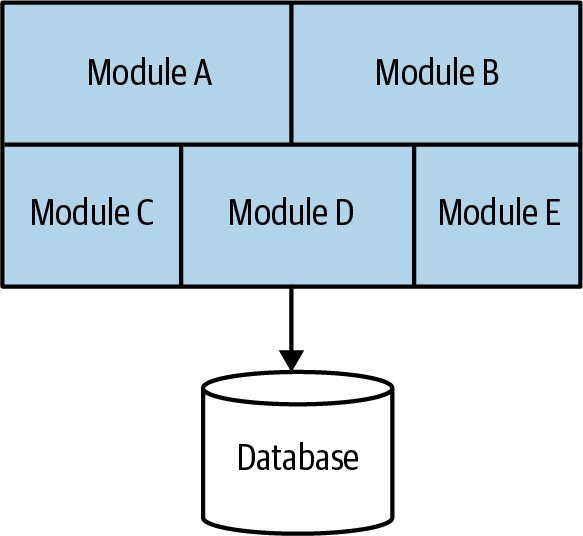
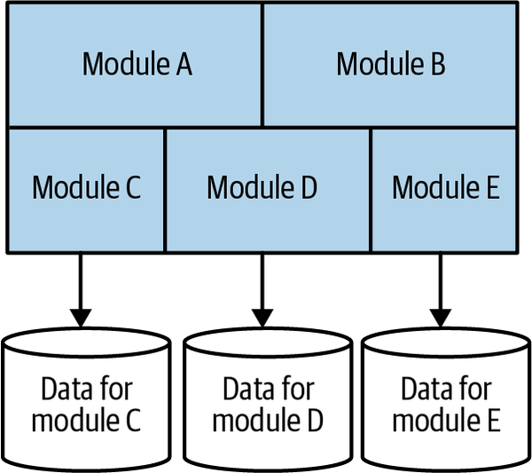
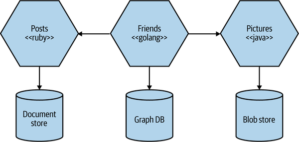
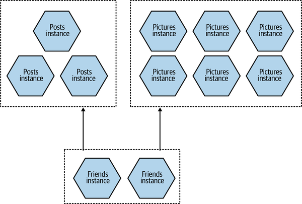
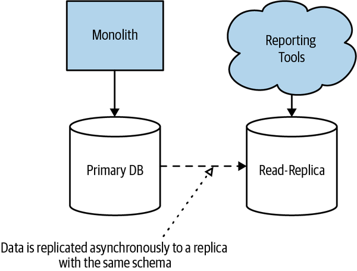

- # 微服务概览
  collapsed:: true
	- 微服务是围绕业务领域建模可独立发布的服务。服务封装了对应功能并可以通过网络被其他服务访问。
	- 从外部来看，单个微服务被视为一个黑盒子。它使用最合适的协议在一个或多个网络端点(例如，队列或REST API)上承载业务功能。消费者，无论他们是其他微服务还是其他类型的程序，都通过这些联网的端点来访问这个功能。内部实现细节(如编写服务的技术或存储数据的方式)完全对外部世界隐藏。这意味着微服务架构在大多数情况下避免使用共享数据库;相反，每个微服务在需要的地方封装自己的数据库。
	  
	- [[信息隐藏]]指的是尽可能少的对外部接口暴露服务信息。微服务公开的网络接口只要向后兼容，就可以自由的对服务内部进行更改。这也符合系统的高内聚低耦合设计思路。
- # 微服务的关键概念
  collapsed:: true
	- ## 独立可部署
		- 我们可以对微服务进行更改、部署并将更改发布给我们的用户，而无需部署任何其他微服务。
	- ## 围绕业务领域建模
		- 对于微服务架构，我们使用像领域驱动设计的思想来定义我们的服务边界。通过围绕业务领域建模服务，我们可以更轻松地推出新功能并以不同方式重组微服务，从而为我们的用户提供新功能。
		- 对于微服务，我们优先考虑业务功能的高内聚性，而不是技术功能的高内聚性。
	- ## 拥有自己的状态
		- 微服务应该避免使用共享数据库。
		- 隐藏微服务中的内部状态类似于面向对象（OO）编程中的封装实践。
	- ## 尺寸
		- Thoughtworks 的技术总监 James Lewis 曾说过“微服务应该和你的脑袋一样大”。
		- 微服务模式（Manning Publications）的作者 Chris Richardson 曾经说过的——微服务的目标是“尽可能小地接口” 。
		- 尺寸并不需要太担心，比这个更需要关注的两件事
			- 你可以处理多少个微服务
			- 增量迁移到微服务架构
	- ## 灵活性
		- James Lewis 说过 “microservices buy you options.”。这句话可以这么理解，微服务架构是有成本的，你必须决定付出的成本是否值得你选择的选项。
		- 越向微服务演进，则灵活性会大幅提升，而这也会增加更多的痛点。所以强烈提倡逐步采用微服务。然后时刻评估引入微服务的影响，并在需要时停下来。
	- ## 架构和组织的一致性
		- 一般的Web业务都会有一个三层架构——前端团队的UI、后端负责的业务逻辑层以及负责管理数据存储的DBA。
		  
		- 如果需要开发一个新的需求，我们需要拆分需求到三个团队，然后需要各个团队以正确的顺序进行部署。这是一种相关技术内聚度高但业务功能内聚度低的架构。
		- 这种组织方式在微服务场景下变的不太适用，我们需要垂直业务线分解组织和架构。
		  
		- 这样变更后，我们的业务领域成为推动我们系统架构的主要力量，能够更容易地进行更改，并使我们更容易将团队与组织内的业务线保持一致。
		- Team Topologies  出品的《高效能团队模式：支持软件快速交付的组织架构》一书中就介绍了这种组织方式的概念：
			- A stream-aligned team is a team aligned to a single, valuable stream of work...[T]he team is empowered to build and deliver customer or user value as quickly, safely, and independently as possible, without requiring hand-offs to other teams to perform parts of the work.
- # 单体
  collapsed:: true
	- ## Single-Process Monolith
	  
		- Ruby on Rails 的创建者 David Heinemeier Hansson 有效地证明了这种架构对小型组织有意义。
	- ## Modular Monolith
	  
		- 对于许多组织来说，模块化单体可以是一个很好的选择。如果模块边界定义良好，它可以支持高度的并行工作，同时通过使用更简单的部署拓扑来避免更分布式微服务架构的挑战。
		- 模块化单体架构的挑战之一是数据库往往缺乏我们在代码级别的拆分，如果你想在未来拆分单体架构，则会面临重大挑战。
		- 我们也看到过一些团队通过将数据库按照与模块相同的方式来拆分进一步推动模块化单体的想法
		  
	- ## Distributed Monolith
	  collapsed:: true
		- 分布式单体是一个由多个服务组成的系统，但无论出于何种原因，整个系统都必须部署在一起。分布式单体架构可能很符合 SOA 的定义，但往往无法兑现 SOA 的承诺。以我的经验，分布式单体具有分布式系统的所有缺点，也具有单体的缺点，但没有足够的优点。
		- 分布式单体通常出现在没有足够关注信息隐藏和业务功能凝聚力等概念的环境中。取而代之的是，高度耦合的体系结构会导致更改跨越服务边界，而看似无害的本地范围内的更改会破坏系统的其他部分。
	- ## 单体和交付竞争
		- 不同的开发人员想要更改同一段代码，不同的团队想要在不同的时间推出功能（或延迟部署），以及围绕谁拥有什么以及谁做决定的混乱局面。大量研究表明，所有权界限混淆的挑战。此问题称为交付竞争。
		- 拥有一个单体并不意味着你肯定会面临交付竞争的挑战，就像拥有一个微服务架构意味着你永远不会面临这个问题一样。但是微服务架构确实为您提供了更具体的边界，可以围绕这些边界在系统中绘制所有权的分界线，从而在减少此问题时为你提供更大的灵活性。
	- ## 单体的优势
		- 单体也有很多优点。更简单的部署拓扑可以避免许多与分布式系统相关的陷阱。这可以使开发人员的工作流程更加简单，监控、故障排除和端到端测试等也可以大大简化。
		- 单体应用还可以简化单体应用内部的代码重用。如果我们想在分布式系统中重用代码，我们需要决定是要复制代码、拆分库还是将共享功能推送到服务中。有了单体，我们的选择就简单多了，很多人喜欢这种简单——所有的代码都在那里；用它！
		- #+BEGIN_NOTE
		  关于代码重用的问题，谷歌提出的单一仓库（所有项目在一个仓库中）其实可以解决，但是这也就导致开发流程变的更复杂。
		  #+END_NOTE
		-
- # 技术采用
  collapsed:: true
  当你升级你的微服务架构时，你应该不断地寻找由日益分散的系统引起的问题，然后寻找可能有帮助的技术。而不是一上来就开始使用各种新的技术。
	- ## 日志聚合与分布式跟踪
		- 随着你管理的微服务越来越多，你就很难了解系统在生产环境中的表现。这也会导致线上故障排除变得更加困难。我们主张日志聚合系统作为采用微服务架构的先决条件。
		- 这些系统允许你收集和汇总所有服务的日志，为你提供一个可以分析日志的中心位置，甚至成为主动警报机制的一部分。该领域的许多选择可满足多种情况。
		- 你可以通过实现相关 ID 使这些日志聚合工具更加有用，其中单个 ID 用于一组相关的服务调用，例如，用户交互而触发的调用链。通过将此 ID 记录为每个日志条目的一部分，隔离与给定调用流相关联的日志变得更加容易，这反过来又使故障排除更加容易。
		- 你的系统变得越来越复杂，因此必须考虑一些工具，这些工具可以让你更好地探索系统正在做什么，提供跨多个服务分析跟踪、检测瓶颈以及提供给你不了解的系统问题的能力。开源工具可以提供其中一些功能。一个例子是Jaeger，它专注于等式的分布式跟踪方面。
	- ## 容器和 Kubernetes
		- 不要急于采用 Kubernetes，甚至是容器。与更传统的部署技术相比，它们绝对具有显着优势，但如果你只有几个微服务，则很难证明采用它们的合理性。在管理部署的开销开始变得令人头疼之后，开始考虑服务的容器化和 Kubernetes 的使用。但是，如果你最终这样做了，请尽最大努力确保有专业人士正在为你维护 Kubernetes 集群，可能是通过使用公共云提供商上的托管服务。运行你自己的 Kubernetes 集群可能需要大量工作！
	- ## 流式传输
		- Apache Kafka已成为微服务环境中流数据的选择，这是有充分理由的。消息持久性、压缩以及处理大量消息的扩展能力等功能非常有用。Kafka 已开始以 KSQLDB 的形式添加流处理功能，但你也可以将其与Apache Flink等专用流处理解决方案一起使用。Debezium是一种开源工具，旨在帮助通过 Kafka 从现有数据源流式传输数据，帮助传统数据源可以成为基于流的架构的一部分。
	- ## 公共云和无服务器
		- 公共云提供商提供大量托管服务，从托管数据库实例或 Kubernetes 集群到消息队列或分布式文件系统。通过使用这些托管服务，你可以将大量工作转嫁给可以更好地处理这些任务的第三方。
		- 功能即服务 (FaaS) 平台特别受关注，因为它们围绕代码部署提供了很好的抽象。你不必担心需要多少台服务器来运行服务，只需部署代码并让底层平台按需处理代码实例。
- # 微服务的优势
  collapsed:: true
	- ## 技术异质性
	  collapsed:: true
		- 一个由多个微服务协作组成的系统，我们可以决定在每个微服务内部使用不同的技术。这使我们能够为每项工作选择正确的工具，而不必选择一种更标准化、一刀切的方法。
		- 微服务可以让你更轻松地拥抱不同的技术
		  
		- 借助微服务，我们还能够更快地采用技术并了解新的进步如何帮助我们。尝试和采用新技术的最大障碍之一是与之相关的风险。对于单体应用程序，如果我想尝试一种新的编程语言、数据库或框架，任何更改都会影响我的大部分系统。有了一个由多种服务组成的系统，我有多个新地方可以尝试一项新技术。我可以选择风险最低的微服务并在那里使用该技术，因为我知道我可以限制任何潜在的负面影响。许多组织发现这种更快地吸收新技术的能力是一个真正的优势。
	- ## 鲁棒性
	  collapsed:: true
		- 一种提高应用程序稳健性的关键概念是隔板。系统的一个组件可能会发生故障，但只要该故障没有级联，你就可以隔离问题，系统的其余部分可以继续工作。服务边界成为明显的隔板。在单体服务中，如果服务失败，一切都会停止工作。使用单体系统，我们可以在多台机器上运行以减少失败的机会，但是使用微服务，我们可以构建系统来处理某些组成服务的完全故障并相应地进行降级。
		- 然而，我们确实需要小心。为了确保我们的微服务系统能够正确地接受这种改进的健壮性，我们需要了解分布式系统必须处理的新故障源。网络会失败，机器也会失败。我们需要知道如何处理此类故障以及这些故障将对我们软件的最终用户产生的影响（如果有的话）。
	- ## 缩放
	  collapsed:: true
		- 在一个大型的单体服务中，我们需要一起扩展所有内容。也许我们整个系统的一小部分在性能上受到限制，但如果这种行为被锁定在一个巨大的单体应用程序中，我们需要将所有东西都作为一个整体来处理。使用微服务，我们可以只扩展那些需要扩展的服务，允许我们在更小、更不强大的硬件上运行系统的其他部分。
		  
	- ## 易于部署
	  collapsed:: true
		- 对百万行单体应用程序的单行更改需要部署整个应用程序才能发布更改。这可能是一个影响大、风险高的部署。在实践中，由于可以理解到的恐惧，诸如此类的部署最终很少发生。不幸的是，这意味着我们的更改会在不同版本之间继续累积，直到我们进入生产环境的应用程序的新版本发生大量更改。版本之间的差异越大，我们出错的风险就越高！
		- 使用微服务，我们可以对单个服务进行更改并独立于系统的其余部分进行部署。这使我们能够更快地部署我们的代码。如果确实出现问题，可以快速将其隔离到单个服务，从而轻松实现快速回滚。这也意味着我们可以更快地将我们的新功能提供给客户。
	- ## 组织协调
	  collapsed:: true
		- 我们中的许多人都经历过与大型团队和大型代码库相关的问题。当团队分散时，这些问题可能会加剧。我们还知道，处理较小代码库的较小团队往往更有效率。
		- 微服务使我们能够更好地使我们的架构与我们的组织保持一致，帮助我们最大限度地减少在任何一个代码库上工作的人数，从而达到团队规模和生产力的最佳平衡点。微服务还允许我们随着组织的变化而改变服务的所有权——使我们能够在未来保持架构和组织之间的一致性。
	- ## 可组合性
	  collapsed:: true
		- 使用微服务，我们允许我们的功能以不同的方式用于不同的目的。当我们考虑消费者如何使用我们的软件时，这一点尤其重要。
		-
- # 微服务的劣势
  collapsed:: true
	- ## 开发者体验
	  collapsed:: true
		- 越来越多的服务，这让本地开发变的复杂，本地环境能运行服务的数量是有限的
		- 极端解决方案“云上开发”，但这会导致反馈周期受到很大影响
		- #+BEGIN_TIP
		  针对于微服务开发部分解决方案确实很少，我了解的方案比如建立内网网关打通开发网络与企业网络，然后来进行开发。但这也只是解决了网络问题。之前了解过云原生工具Nocalhost，可以缩短整个开发反馈周期，并且可以和IDE直接集成。
		  #+END_TIP
	- ## 技术过载
	  collapsed:: true
		- 微服务很可能让你可以选择使用不同的编程语言编写每个微服务、在不同的运行时上运行或使用不同的数据库——但这些只是选项，而不是要求。你必须仔细平衡你使用的技术的广度和复杂性与各种技术可能带来的成本。
		- 当你开始采用微服务时，一些基本挑战是不可避免的：你需要花费大量时间来了解围绕数据一致性、延迟、服务建模等问题。如果你试图了解这些想法如何改变你对软件开发的看法，同时你正在接受大量新技术，那么你将遇到困难。还需要知道的是，尝试了解所有这些新技术所将占用你大量的时间，同时也将减少功能实际交付给用户的时间。
		- 随着你增加微服务架构的复杂性，请考虑根据需要引入新技术。当你拥有三个服务时，你不需要 Kubernetes 集群！除了确保你不会因这些新工具的复杂性而不堪重负之外，这种逐渐增加的额外好处是使你能够获得新的更好的做事方式，这些方式无疑会随着时间的推移而出现。
	- ## 成本
	  collapsed:: true
		- 短期来看，你会看到因为引入微服务你的成本会随之增加。
		- 其次学习新的技术和思想以及团队工作方式的变更都需要时间。这将导致新功能交付变缓，你或许需要更多的人员来抵消这一成本。
		- 根据经验，对于一个主要关注降低成本的组织来说，微服务是一个非常糟糕的选择，因为决策者将始终有削减陈本的心态，而IT被视为成本中心而不是利润中心。另一方面，如果你可以使用这一架构来接触更多的客户或并行开发更多功能，那么微服务可以帮你赚到更多的钱。微服务是增加利润的一种方式吗？也许。那微服务是降低成本的方法吗？基本不可能。
	- ## 报表
	  collapsed:: true
		- 对于单体系统，通常只有一个数据库。这就意味着想要分析所有数据，只需要对这个数据库（也可能针对只读副本）进行报表的生成。
		  
		- 通过微服务架构，我们打破了这种单体架构。这并不意味着我们不再需要生成报表；我们只是让它变得更加困难，因为现在我们的数据分散在多个逻辑隔离的模式中。
		- 更现代的报表生成的方法，例如使用流式传输来允许对大量数据进行实时传输，这可以很好地与微服务架构配合使用，但通常需要采用新的想法和相关技术。或者，可能只需将微服务中的数据发布到中央报表数据库（或者可能是不太结构化的数据湖）中。
	- ## 监控和故障排除
	  collapsed:: true
		- 对于一个标准的单体应用程序，我们可以相当简单的进行监控。我们要担心的机器数量很少，应用程序的故障模式也很单一——应用程序通常要么全部启动，要么全部关闭。使用微服务架构，如果只有一个服务实例出现故障，我们是否了解其影响？
		- 对于单体系统，如果我们的 CPU 长时间卡在 100%，我们知道这是一个大问题。拥有数十或数百个进程的微服务架构，我们可以说同样的话吗？当只有一个进程卡在 100% CPU 时，我们是否需要在凌晨 3 点叫醒某人？
	- ## 安全
	  collapsed:: true
		- 现在，更多信息通过我们的服务之间的网络流动。这可能使我们的数据更容易在传输过程中被观察到，并且可能被作为中间人攻击的一部分进行操纵。这意味着您可能需要更加小心地保护传输中的数据，并确保您的微服务端点受到保护，以便只有授权方才能使用它们。
	- ## 测试
	  collapsed:: true
		- 对于任何类型的自动化功能测试，你都有一个微妙的平衡行为。测试执行的功能越多（即测试范围越广），你对应用程序的信心就越大。另一方面，测试的范围越大，设置测试数据和支持的工具就越困难，测试运行的时间就越长，当它失败时就越难弄清楚什么是坏的。
		- 就其涵盖的功能而言，任何类型系统的端到端测试都处于规模的极端，而且我们习惯于它们在编写和维护方面比小范围的单元测试更有问题。但是，这通常是值得的，因为我们希望通过端到端测试以与用户相同的方式使用我们的系统来获得信心。
		- 但是使用微服务架构，我们端到端测试的范围变得非常大。我们现在需要跨多个进程运行测试，所有这些都需要针对测试场景进行部署和适当配置。我们还需要为环境问题（例如服务实例死亡或部署失败的网络超时）导致我们的测试失败时发生的误报做好准备。
		- 这些力量意味着，随着你的微服务架构的发展，你在端到端测试方面的投资回报将逐渐减少。测试将花费更多，但无法给你与过去相同的信心。这将推动你走向新的测试形式，例如合同驱动测试或生产测试，以及探索渐进式交付技术，例如并行运行或金丝雀发布。
	- ## 延迟
	  collapsed:: true
		- 以前可能在一个处理器上本地完成的处理现在最终可以拆分为多个单独的微服务。以前仅在单个进程中流动的信息现在需要通过网络进行序列化、传输和反序列化，你可能比以往任何时候都更频繁地使用这些网络。所有这些都可能导致系统延迟恶化。
		- 尽管在设计或编码阶段很难衡量对操作延迟的确切影响，但这是以增量方式进行任何微服务迁移很重要的另一个原因。做一个小的改变，然后衡量影响。这假设你有某种方法可以测量你关心的操作的端到端延迟——像 Jaeger 这样的分布式跟踪工具可以在这里提供帮助。但是你还需要了解 这些操作可接受的延迟时间。有时让操作变慢是完全可以接受的，只要它仍然足够快！
	- ## 数据一致性
	  collapsed:: true
		- 在单个数据库中存储和管理数据的单体系统到在不同数据库中管理多个进程的分布式系统，这对数据的一致性造成了潜在的挑战。尽管过去你可能依赖数据库事务来管理状态更改，但你需要了解在分布式系统中不容易提供类似的安全性。在大多数情况下，分布式事务的使用被证明在协调状态更改方面存在很大问题。
		- 相反，你可能需要开始使用 sagas 和最终一致性等概念来管理和推理系统中的状态。这些想法可能需要从根本上改变你对系统中数据的思考方式，这在迁移现有系统时可能会非常令人生畏。再一次，这是另一个在分解应用程序时要谨慎的好理由。采用增量方法进行分解，以便你能够评估更改对生产体系结构的影响，这一点非常重要。
- # 我应该使用微服务吗
  collapsed:: true
	- ## 它们可能不适合为谁工作
		- 微服务架构对于全新的产品或初创公司来说往往是一个糟糕的选择。
			- 往往全新的产品或初创公司在前期业务改动会非常频繁，服务边界无法确定，域模型也无法很好的建立，但这是微服务的前置条件。
			- 微服务带来了新工作和复杂性，这会占用宝贵的开发资源。团队越小，这种成本就越明显。
	- ## 它们在哪里工作的更好
		- 组织采用微服务的最大原因可能是允许更多的开发人员在同一个系统上工作，而不会互相妨碍。正确设置架构和组织边界，让更多人彼此独立工作，从而减少交付争用。一家五人创业公司可能会觉得微服务架构很麻烦。一个快速增长的 100 人规模化企业可能会发现，它的增长更容易适应与其产品开发工作适当协调的微服务架构。
		- 软件即服务 (SaaS)，这类非常适合微服务架构。这些产品通常需要 24-7 小时运行，这在推出变更时会带来挑战。微服务架构的独立可发布性是该领域的一大福音。此外，微服务可以根据需要扩大或缩小。这意味着，当你为系统的负载特性建立一个合理的基线时，你将获得更多控制权，以确保你可以以最具成本效益的方式扩展您的系统。
		- 微服务与技术无关的特性确保可以充分利用云平台。公共云供应商为你的代码提供广泛的服务和部署机制。你可以更轻松地将特定服务的要求与最能帮助你实施它们的云服务相匹配。例如，你可能决定将一个服务部署为一组功能，另外部署为托管虚拟机 (VM)，还可以部署在托管平台即服务 (PaaS) 平台上。
		- 值得注意的是，采用广泛的技术通常会成为一个问题，但能够轻松尝试新技术是快速识别可能产生效益的好方法。FaaS 平台的日益普及就是这样一个例子。对于适当的工作负载，FaaS 平台可以大大减少运营开销，但目前，它并不是一种适用于所有情况的部署机制。
		- 微服务还为希望通过各种新渠道为客户提供服务的组织带来了明显的好处。许多数字化转型工作似乎都涉及尝试解锁隐藏在现有系统中的功能。我们的愿望是创造新的客户体验，通过任何最有意义的交互机制来支持用户的需求。
		- 最重要的是，微服务架构可以在你继续发展系统时为你提供很大的灵活性。当然，这种灵活性是有代价的，但如果你想在未来可能想要做出的改变方面保持开放的选择，这可能是一个值得付出的代价。
- # 概括
  collapsed:: true
	- 微服务架构可以为你在技术选择、处理健壮性和扩展性、组织团队等方面提供极大的灵活性。这种灵活性是许多人采用微服务架构的部分原因。但是微服务带来了很大程度的复杂性，你需要确保这种复杂性是合理的。对于许多人来说，它们已成为默认的系统架构，几乎可以在所有情况下使用。但是，我仍然认为它们是一种架构选择，必须根据你要解决的问题来证明其使用是合理的；通常，更简单的方法可以更轻松地交付。
	- 尽管如此，许多组织，尤其是大型组织，已经展示了微服务的有效性。当微服务的核心概念被正确理解和实施时，它们可以帮助创建授权、高效的架构，从而帮助系统变得不仅仅是其部分的总和。