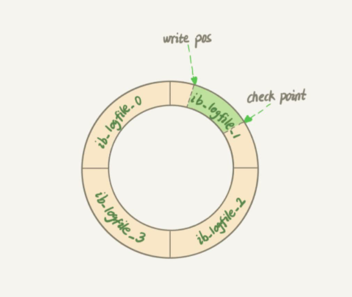
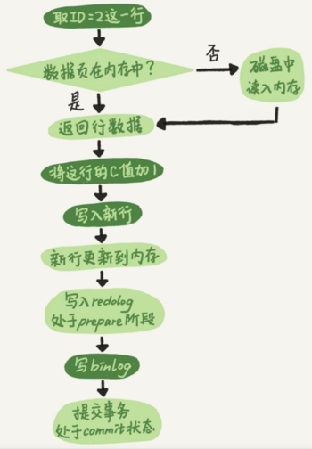

- 在执行查询请求时提到过，如果有更新操作，查询缓存会失效
- 接下来，分析器会通过词法和语法解析知道这是一条更新语句。优化器决定要使用 ID 这个
  索引。然后，执行器负责具体执行，找到这一行，然后更新。
- 与查询流程不一样，更新还涉及两个日志模块 redo log、binlog。
- **redo log**
	- WAL 技术全称Write-Ahead Logging ，它的关键点事先写日志，再写磁盘。
	- InnoDB redo log是固定大小的，而且是循环写。
	- 
	- write pos 是当前记录的位置，一边写一边后移，写到第 3 号文件末尾后就回到 0 号文件
	  开头。checkpoint 是当前要擦除的位置，也是往后推移并且循环的，擦除记录前要把记录
	  更新到数据文件。
	- write pos 和 checkpoint 之间的空白部分，可以用来记录新的操作。如果 write pos 追上 checkpoint，表示记录满了，这时候不能再执行新的更新，得停下来先删除一些记录，把 checkpoint 推进一下。
	- 有了 redo log，InnoDB 就可以保证即使数据库发生异常重启，之前提交的记录都不会丢失，这个能力称为
	  crash-safe。
- **binlog**
	- Binlog有两种模式，statement 格式的话是记sql语句，row格式会记录行的内容，记两条，更新前和更新后。
	- 两个日志的差异
		- redo log 是 InnoDB 引擎特有的；binlog 是 MySQL 的 Server 层实现的，所有引擎都可以使用。
		- redo log 是物理日志，记录的是“在某个数据页上做了什么修改”；binlog 是逻辑日志，记录的是这个语句的原始逻辑。
		- redo log 是循环写，空间固定会用完；binlog是追加写。
	- 执行流程
		- 执行器先找到引擎取ID=2这行，ID是主键，引擎直接用树搜索找到这行。如果查询数据所在的数据页本身在内存中，则直接返回；否则需要先从磁盘读入内存，然后返回。
		- 执行器拿到行数据后，执行更新操作，例如将值加上1，比如原来为 N，则现在就是N+1，得到新的一行数据，再调用引擎接口写入新数据。
		- 引擎将新数据更新到内存中，同时将更新的操作记录写到redo log 中，此时redo log 处于 prepare 状态。然后告知执行器执行完成了，随时可以提交事务。
		- 执行器生成这个操作的binlog，并把binlog写入磁盘。
		- 执行器调用引擎的提交事务接口，引擎把刚写入的redo log 改成提交（commit）状态，更新完成。
		- 
		-
	-
	-
	-
	-